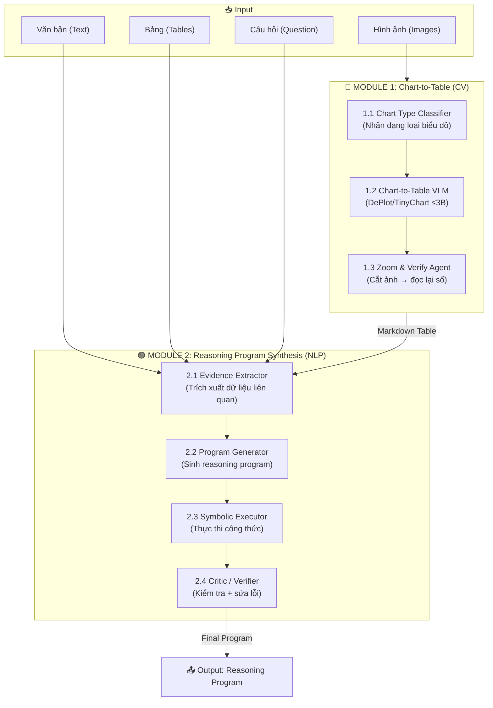

# 🏗️ ViNumQA Master Plan: Two-Module Pipeline (CV + NLP)

> **Mục tiêu**: Thiết kế hệ thống tối ưu cho cuộc thi VLSP 2026 ViNumQA  
> **Ràng buộc**: Mỗi model ≤ 8B params | Kaggle T4 x2 (16GB VRAM/card) | Số lượng model không giới hạn  
> **Output**: Reasoning Program (DSL: `add`, `subtract`, `divide`, `table_max`, `chart_at`, ...)

---

## I. Tổng hợp Đặc điểm Hữu ích từ 15 Bài Báo

### 🔵 Nhóm A: Chart-to-Table (CV Module)

| Bài báo | Kỹ thuật cốt lõi | Ứng dụng cho ViNumQA |
|---|---|---|
| **DePlot** (Google DeepMind) | Mô hình 282M params, chuyển ảnh biểu đồ → Markdown Table. Đạt RMS-F1 = 94.2 | Dùng làm baseline nhẹ nhất cho Stage 1. Plug-and-play với bất kỳ LLM nào |
| **MatCha** (Google DeepMind) | Pre-train Pix2Struct với 2 task: Chart Derendering + Math Reasoning. Tăng ~20% so với SOTA | Dùng làm nền tảng pre-training cho VLM. Task "Chart Derendering" = bóc code/table từ ảnh |
| **ChartAssistant** (OpenGVLab) | Two-stage training: Chart-to-Table alignment → Multitask Instruction Tuning. CoT tăng từ 51.9% → 72.1% | Chiến thuật training: Bắt model sinh Chain-of-Thought functions thay vì đoán số trực tiếp |
| **ChartAgent (CVPR)** | Tool-Integrated Reasoning: YOLO + SAM + OCR + Zoom. Evidence Package. Multi-expert voting | Kiến trúc Agent: Model 8B làm "bộ não", gọi tools nhẹ (YOLO, OCR) để bóc tách |
| **ChartAgent (ACL)** | Two-stage: VLM → Initial Table + ReAct Agent → Correction. **Zoom Tool** cắt ảnh 4 góc phóng to | **Zoom Tool**: Giải quyết vấn đề ảnh dày đặc trên T4 bằng cách cắt nhỏ, đọc từng phần |
| **ExChart** (CHI 2026) | Two-stage training: Coordinate Geometry Perception → Full Table Extraction. SOTA với 7B model | Training framework mới nhất: Dạy model hiểu hệ tọa độ trước → bóc bảng sau. Đạt SOTA chỉ với 7B |
| **Do LVLMs Understand Charts?** | 82% caption chứa lỗi sai sự thật. C2TFEC: Chart→Table→LLM sửa lỗi | Cảnh báo: Đừng tin VLM đoán số. Bắt buộc phải bóc bảng rồi mới suy luận |

### 🟢 Nhóm B: Numerical Reasoning (NLP Module)

| Bài báo | Kỹ thuật cốt lõi | Ứng dụng cho ViNumQA |
|---|---|---|
| **FinQA** (UCSB + JP Morgan) | DSL gồm 10 operators (`add`, `subtract`, `table_max`...). Retriever-Generator framework. Expert accuracy 91% vs Model 65% | **Bài báo gốc** của format DSL mà ViNumQA sử dụng. Dùng làm reference cho cú pháp reasoning program |
| **TAT-LLM** (NUS) | Step-wise Pipeline: Extractor → Reasoner → Executor. Fine-tune LLaMA-7B đánh bại GPT-4 trên FinQA | **Pipeline 3 bước cực kỳ quan trọng**: Trích xuất evidence → Sinh công thức → Thực thi. TAT-LLM 7B > GPT-4 |
| **MathQA** (UW) | 58 toán tử, Domain Categorization để giới hạn hàm. Seq2Prog model | **Constraint Decoding**: Phân loại câu hỏi theo domain → giới hạn tập hàm được phép sinh ra |
| **DocFinQA** (Kensho) | Mở rộng FinQA thành long-document (123K words). Retrieval pipeline: ColBERT + SentBERT | **Retrieval**: Khi document dài, cần chunk + retrieve đúng đoạn chứa evidence trước khi reasoning |
| **Program Synthesis (EACL 2023)** | NL→SQL via Filtered Iterative Back-Translation + PCFG. Đạt 60.44% trên PlotQA reasoning | **Data Augmentation**: Dùng PCFG sinh thêm training data cho reasoning program khi thiếu nhãn |
| **Multi-Agent Reflection** (UIC) | Expert Agent + Critic Agent(s). LLaMA-8B tăng 15% so với single-agent. Ngang GPT-4o-mini | **Multi-Agent**: Dùng 1 agent sinh program + 1 agent kiểm tra → tăng 15% accuracy |
| **HierFinRAG** (BUV) | Graph Neural Network liên kết Table-Text. Symbolic-Neural Fusion: LLM + Calculator | **Symbolic Executor**: Route phép tính sang Calculator thay vì bắt LLM tự tính |
| **ChartQA** (York Univ) | Gold Table accuracy 61% vs Extracted Table 45%. Chênh lệch 16% do lỗi OCR/extraction | Khẳng định: Chất lượng bảng quyết định 100% chất lượng reasoning. Phải ưu tiên CV |

---

## II. Pipeline Tổng Thể: Kiến Trúc 2-Module



---

## III. Chi Tiết Từng Module

### 🔵 MODULE 1: Chart-to-Table (CV Pipeline)

#### 1.1 Chart Type Classifier
- **Nguồn cảm hứng**: ChartAgent (CVPR) — Classification Tool
- **Mô hình**: Fine-tune một classifier nhẹ (ResNet-18 hoặc EfficientNet-B0, ~11M params)
- **Chức năng**: Nhận diện loại biểu đồ (bar, line, pie, radar, scatter) → Quyết định chiến thuật bóc tách phù hợp
- **Lý do**: Mỗi loại biểu đồ cần prompt/strategy khác nhau cho VLM

#### 1.2 Chart-to-Table VLM (Core Extraction)
- **Nguồn cảm hứng**: DePlot + MatCha + ExChart
- **Mô hình chính**: `TinyChart-3B` hoặc `Qwen2-VL-2B`
  - Nhẹ, vừa vặn T4 16GB, dành toàn bộ VRAM cho batch processing
- **Training Strategy** (từ ExChart + ChartAssistant):
  1. **Stage 1**: Pre-train trên task "Coordinate Geometry Perception" — dạy model hiểu trục tọa độ
  2. **Stage 2**: Fine-tune trên Chart-to-Table — sinh Markdown Table từ ảnh
- **Output**: Bảng Markdown có header + rows + values

#### 1.3 Zoom & Verify Agent (Error Correction)
- **Nguồn cảm hứng**: ChartAgent (ACL) — Zoom Tool + ReAct Agent
- **Mô hình**: Dùng cùng VLM ở bước 1.2, nhưng với input là ảnh đã cắt nhỏ
- **Quy trình**:
  1. So sánh Initial Table với ảnh gốc (cross-verification)
  2. Nếu có cell bất thường (giá trị quá lớn/nhỏ, NaN, thiếu): Cắt ảnh thành 4 quadrants
  3. Feed từng quadrant vào VLM → đọc lại giá trị → merge vào bảng
- **Kỹ thuật bổ sung** (từ ChartAgent CVPR):
  - Evidence Package: Lưu tất cả intermediate results để truy vết lỗi
  - Color Matching: Gióng màu legend với bar/line để map đúng series

> [!TIP]
> **Lợi thế VRAM**: Ảnh cắt nhỏ 1/4 → số pixels giảm 4x → VRAM giảm ~4x → T4 xử lý thoải mái

---

### 🟢 MODULE 2: Reasoning Program Synthesis (NLP Pipeline)

#### 2.1 Evidence Extractor
- **Nguồn cảm hứng**: TAT-LLM (Step 1: Extractor) + DocFinQA (Retrieval)
- **Mô hình**: Cùng LLM 7B-8B (ví dụ: `Qwen2.5-7B-Instruct`)
- **Chức năng**: 
  - Đọc Question + Text + Table (đã bóc từ CV module) 
  - Trích xuất các con số và đoạn văn bản liên quan (evidence)
- **Prompt Template** (theo TAT-LLM):
  ```
  ### Instruction
  Step 1 - Extractor: Từ bảng và văn bản dưới đây, hãy trích xuất 
  các giá trị số và thông tin liên quan để trả lời câu hỏi.
  
  ### Table
  {markdown_table}
  
  ### Text
  {context_text}
  
  ### Question
  {question}
  
  ### Response
  | Step | Output |
  | 1 | {extracted_values} |
  ```

#### 2.2 Program Generator
- **Nguồn cảm hứng**: FinQA (DSL) + MathQA (Constraint Decoding) + DePlot (PoT)
- **Mô hình**: Cùng LLM 7B-8B (tiếp tục từ bước 2.1 trong cùng 1 lượt inference)
- **Chức năng**:
  - Nhận evidence từ bước 2.1
  - Sinh ra chuỗi reasoning program theo DSL của ViNumQA
- **Kỹ thuật quan trọng**:
  - **Constraint Decoding** (từ MathQA): Giới hạn vocabulary output chỉ chứa các token hợp lệ (`add`, `subtract`, `divide`, `multiply`, `table_max`, `chart_at`, `#0`, `#1`, ...)
  - **Program-of-Thoughts** (từ DePlot): Ép model viết hàm thay vì đoán số
- **Prompt Template**:
  ```
  Step 2 - Reasoner: Dựa trên các giá trị đã trích xuất, hãy sinh ra 
  công thức tính toán dưới dạng reasoning program.
  
  Các hàm được phép: add, subtract, multiply, divide, greater, exp, 
  table_max, table_min, table_sum, table_average
  
  Dùng #0, #1, ... để tham chiếu kết quả bước trước.
  
  | 2 | {reasoning_program} |
  ```

#### 2.3 Symbolic Executor
- **Nguồn cảm hứng**: HierFinRAG (Symbolic-Neural Fusion) + TAT-LLM (External Executor)
- **Không cần model**: Chỉ cần Python script
- **Chức năng**: 
  - Parse reasoning program thành AST
  - Thực thi từng bước toán học bằng Python (không phụ thuộc LLM)
  - Trả về kết quả số

```python
def execute_program(program, context):
    """Thực thi reasoning program theo DSL"""
    results = {}
    for step_id, (op, args) in enumerate(program):
        resolved_args = [results[a] if a.startswith('#') else float(a) for a in args]
        if op == 'add': results[f'#{step_id}'] = resolved_args[0] + resolved_args[1]
        elif op == 'subtract': results[f'#{step_id}'] = resolved_args[0] - resolved_args[1]
        elif op == 'multiply': results[f'#{step_id}'] = resolved_args[0] * resolved_args[1]
        elif op == 'divide': results[f'#{step_id}'] = resolved_args[0] / resolved_args[1]
        elif op == 'table_max': results[f'#{step_id}'] = max(context[args[0]])
        # ... other ops
    return results[f'#{len(program)-1}']
```

#### 2.4 Critic / Verifier Agent
- **Nguồn cảm hứng**: Multi-Agent Reflection + Do LVLMs Understand Charts?
- **Mô hình**: Cùng LLM 7B-8B hoặc model khác (chạy lượt 2)
- **Chức năng**:
  1. **Data Extraction Critic**: Kiểm tra xem các số trong program có tồn tại trong bảng/text không
  2. **Calculation Critic**: Kiểm tra xem phép tính có logic không (ví dụ: chia cho 0, kết quả âm khi hỏi %)
  3. Nếu phát hiện lỗi → quay lại bước 2.2 với feedback
- **Prompt Template** (theo Multi-Agent Reflection):
  ```
  Bạn là một Critic Agent. Hãy kiểm tra:
  1. Các số {extracted_values} có đúng với bảng/text không?
  2. Công thức {program} có logic không?
  3. Kết quả {answer} có hợp lý không?
  
  Nếu sai, hãy chỉ ra lỗi cụ thể.
  ```

---

## IV. Phân Bổ Tài Nguyên Trên Kaggle T4 x2

| Component | Model | Params | GPU | VRAM Est. |
|---|---|---|---|---|
| Chart Classifier | EfficientNet-B0 | 5M | GPU 0 | ~0.5 GB |
| Chart-to-Table VLM | TinyChart-3B / DePlot | ≤3B | GPU 0 | ~6 GB |
| Zoom VLM (cùng model) | (chia sẻ weights) | — | GPU 0 | (đã tính) |
| Evidence Extractor + Program Generator | Qwen2.5-7B (QLoRA 4-bit) | 7B | GPU 1 | ~5 GB |
| Critic Agent | (cùng Qwen2.5-7B) | — | GPU 1 | (đã tính) |
| Symbolic Executor | Python script | 0 | CPU | 0 |
| **Tổng** | | | | **~12 GB/card** ✅ |

> [!IMPORTANT]
> Tổng VRAM ước tính ~12GB/card, dư ~4GB buffer cho batch processing. Hoàn toàn khả thi!

---

## V. Kế Hoạch Code Chi Tiết

### Phase 0: Chuẩn bị Dữ liệu (Ngày 1-2)

```
📁 vinumqa/
├── data/
│   ├── prepare_dataset.py      # Parse train.json, chia train/val (80/20)
│   ├── analyze_programs.py     # Thống kê DSL operators, phân loại câu hỏi
│   └── extract_chart_samples.py # Tách riêng samples có images để train CV
├── configs/
│   └── base_config.yaml        # Hyperparameters, paths, model names
└── utils/
    ├── dsl_parser.py           # Parse + validate reasoning programs
    └── metrics.py              # Program accuracy + Execution accuracy
```

**Tasks**:
- [ ] Parse `train.json` → tách thành `train_split.json` + `val_split.json`
- [ ] Thống kê phân bổ operators (add, subtract, divide, table_max, chart_at...)
- [ ] Phân loại samples: chỉ có text+table vs. có cả images
- [ ] Viết DSL parser và executor
- [ ] Viết evaluation metrics (Program Accuracy + Execution Accuracy)

### Phase 1: CV Module — Chart-to-Table (Ngày 3-7)

```
📁 vinumqa/
├── cv_module/
│   ├── chart_classifier/
│   │   ├── train_classifier.py   # Fine-tune EfficientNet-B0
│   │   └── classify.py           # Inference: ảnh → loại biểu đồ
│   ├── chart_to_table/
│   │   ├── prepare_c2t_data.py   # Chuẩn bị data (chart, table) pairs
│   │   ├── train_vlm.py          # Fine-tune TinyChart/DePlot cho Chart→Table
│   │   └── extract_table.py      # Inference: ảnh → Markdown Table
│   ├── zoom_verify/
│   │   ├── zoom_tool.py          # Cắt ảnh 4 quadrants + phóng to
│   │   └── verify_agent.py       # So sánh bảng với ảnh, sửa lỗi
│   └── pipeline.py               # Orchestrate toàn bộ CV pipeline
```

**Tasks**:
- [ ] Download + setup TinyChart-3B (hoặc DePlot) trên Kaggle
- [ ] Viết `zoom_tool.py`: cắt ảnh thành 4 phần, resize lên 1024x1024
- [ ] Viết `extract_table.py`: chạy VLM → sinh Markdown Table
- [ ] Viết `verify_agent.py`: ReAct loop kiểm tra + sửa bảng
- [ ] Test end-to-end: ảnh biểu đồ → Markdown Table chính xác
- [ ] Đo RMS-F1 trên validation set (Target: > 90%)

### Phase 2: NLP Module — Reasoning Program Synthesis (Ngày 8-14)

```
📁 vinumqa/
├── nlp_module/
│   ├── data_prep/
│   │   ├── format_training_data.py  # Chuyển train.json → instruction format
│   │   ├── augment_data.py          # Sinh thêm training data (PCFG/template)
│   │   └── multitask_mixing.py      # Trộn thêm task phụ (table→summary, ...)
│   ├── training/
│   │   ├── train_qlora.py           # QLoRA fine-tune Qwen2.5-7B
│   │   ├── lora_config.py           # LoRA hyperparams (r=16, alpha=32)
│   │   └── step_wise_template.py    # Template cho Step-wise Pipeline
│   ├── inference/
│   │   ├── generate_program.py      # Inference: Q + Table + Text → Program
│   │   ├── constrained_decode.py    # Constraint decoding (giới hạn DSL tokens)
│   │   └── symbolic_executor.py     # Thực thi program bằng Python
│   ├── critic/
│   │   ├── data_critic.py           # Kiểm tra số liệu có tồn tại
│   │   ├── calc_critic.py           # Kiểm tra logic phép tính
│   │   └── reflection_loop.py       # Orchestrate: Generate → Critique → Regenerate
│   └── pipeline.py                   # Orchestrate toàn bộ NLP pipeline
```

**Tasks**:
- [ ] Viết `format_training_data.py`: Chuyển mỗi sample thành format Step-wise Pipeline của TAT-LLM:
  ```
  | Step | Output |
  | 1 (Extractor) | value1#value2#value3 |
  | 2 (Reasoner) | divide(value1, value2), subtract(#0, value3) |
  | 3 (Executor) | final_answer |
  ```
- [ ] Viết `augment_data.py`: 
  - Sinh thêm QA pairs bằng cách hoán đổi giá trị trong bảng
  - Sinh thêm task phụ: "Hãy tóm tắt bảng này" (multitask tuning từ ChartAssistant)
- [ ] Setup QLoRA training trên Kaggle:
  - Model: `Qwen2.5-7B-Instruct`
  - LoRA: r=16, alpha=32, target_modules=["q_proj", "v_proj", "k_proj", "o_proj"]
  - Training: 3 epochs, lr=2e-4, batch_size=4, gradient_accumulation=4
- [ ] Viết `constrained_decode.py`: Logit masking chỉ cho phép DSL tokens
- [ ] Viết `symbolic_executor.py`: Parse DSL → thực thi bằng Python
- [ ] Viết `reflection_loop.py`: Generate → Critic checks → Regenerate nếu lỗi (max 2 rounds)

### Phase 3: Integration & Optimization (Ngày 15-18)

```
📁 vinumqa/
├── pipeline/
│   ├── full_pipeline.py       # CV → NLP → Output
│   ├── batch_inference.py     # Batch processing cho test set
│   └── submission.py          # Format output cho nộp bài
├── evaluation/
│   ├── eval_cv.py             # Đánh giá riêng CV module (RMS-F1)
│   ├── eval_nlp.py            # Đánh giá riêng NLP module (Program Acc)
│   └── eval_e2e.py            # Đánh giá end-to-end (Execution Acc)
└── experiments/
    ├── ablation_zoom.py       # So sánh có/không Zoom Tool
    ├── ablation_critic.py     # So sánh có/không Critic Agent
    └── ablation_multitask.py  # So sánh có/không Multitask training
```

**Tasks**:
- [ ] Kết nối CV Pipeline → NLP Pipeline: Markdown Table chảy tự động vào prompt
- [ ] Viết `batch_inference.py`: Xử lý toàn bộ test set, quản lý VRAM
- [ ] Chạy ablation experiments:
  - Baseline: LLM only (không dùng CV) → Execution Accuracy
  - + Chart-to-Table → tăng bao nhiêu %?
  - + Zoom Tool → tăng bao nhiêu %?
  - + Critic Agent → tăng bao nhiêu %?
  - + Constraint Decoding → tăng bao nhiêu %?
- [ ] Optimize inference speed: Batching, KV-cache, vllm
- [ ] Format submission file

---

## VI. Thứ Tự Ưu Tiên Kỹ Thuật

> [!CAUTION]
> Đây là thứ tự ưu tiên theo **mức độ ảnh hưởng đến kết quả cuối cùng**, dựa trên bằng chứng từ các bài báo:

| Ưu tiên | Kỹ thuật | Bài báo gốc | Impact ước tính |
|---|---|---|---|
| 🔴 **P0** | Step-wise Pipeline (Extractor→Reasoner→Executor) | TAT-LLM | +20% so với End-to-end |
| 🔴 **P0** | Chart-to-Table Extraction | DePlot, ChartQA | +16% (Gold Table vs Extracted) |
| 🟠 **P1** | Constraint Decoding (giới hạn DSL tokens) | MathQA | +5-10% (giảm hallucination) |
| 🟠 **P1** | Symbolic Executor (Python thay vì LLM tự tính) | HierFinRAG, TAT-LLM | +5-8% (giảm lỗi tính toán) |
| 🟡 **P2** | Zoom Tool (cắt ảnh phóng to) | ChartAgent (ACL) | +3-5% (trên ảnh dày đặc) |
| 🟡 **P2** | Critic Agent (Multi-Agent Reflection) | Multi-Agent Reflection | +5% (LLaMA-8B) |
| 🔵 **P3** | Multitask Training (trộn task phụ) | ChartAssistant | +2-3% (giảm overfitting) |
| 🔵 **P3** | Data Augmentation (PCFG sinh thêm) | Program Synthesis (EACL) | +2-3% (khi thiếu data) |

---

## VII. Rủi Ro & Phương Án Dự Phòng

| Rủi ro | Xác suất | Phương án dự phòng |
|---|---|---|
| VLM bóc bảng sai quá nhiều (RMS-F1 < 80%) | Trung bình | Dùng OCR (Tesseract/PaddleOCR) kết hợp rule-based extraction thay thế |
| OOM trên T4 khi chạy VLM + LLM cùng lúc | Thấp | Chạy tuần tự: VLM xong → free VRAM → load LLM. Hoặc dùng offloading |
| Constraint Decoding làm chậm inference | Thấp | Pre-compute allowed token IDs, dùng logit processor nhẹ |
| Critic Agent loop vô hạn | Thấp | Hard limit max 2 reflection rounds |
| Train data không đủ (chỉ 1,725 samples) | Cao | Data Augmentation bằng PCFG + template. Trộn FinQA/TAT-QA data |

---

> [!NOTE]
> **Bước tiếp theo**: Sau khi bạn review plan này, hãy confirm để tôi bắt đầu code từ **Phase 0** (Chuẩn bị dữ liệu + DSL Parser + Metrics). Đây là nền tảng bắt buộc trước khi bắt tay vào CV hay NLP module.
